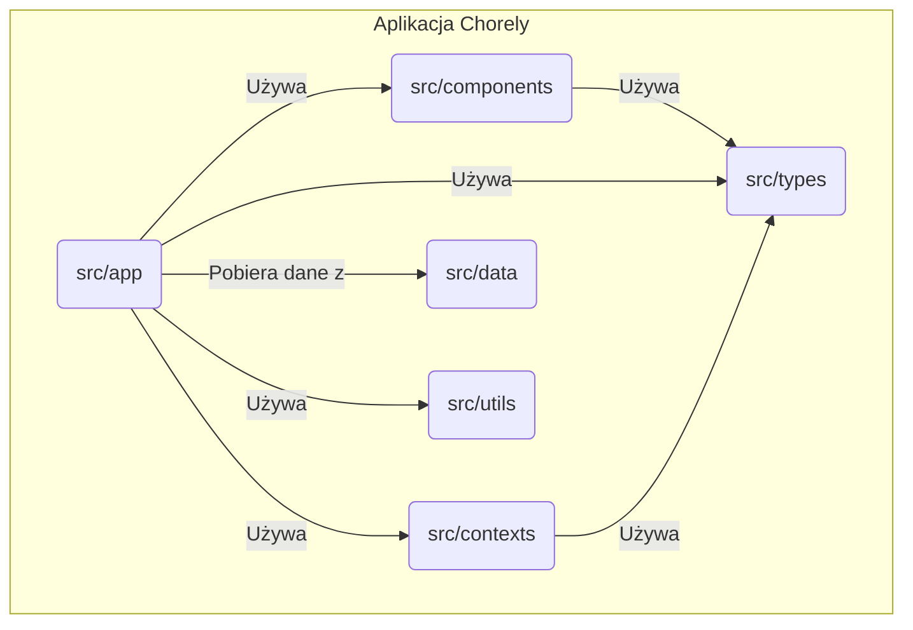

# Dokumentacja Techniczna Aplikacji Chorely

## 1. Wprowadzenie

Niniejsza dokumentacja opisuje techniczną strukturę i działanie aplikacji Chorely. Przeznaczona jest dla deweloperów oraz osób zainteresowanych wewnętrznym funkcjonowaniem projektu.

## 2. Struktura Projektu i Moduły

Projekt oparty jest o architekturę zorientowaną na moduły, co ułatwia zarządzanie kodem i jego rozwój. Główny kod aplikacji znajduje się w katalogu `src/`.

```
chorely/
├── .next/           # Pliki budowania Next.js
├── node_modules/    # Zależności projektu
├── public/          # Pliki statyczne (fonty, obrazki)
├── src/             # Główny kod źródłowy aplikacji
│   ├── app/         # Główne strony i logika aplikacji (Next.js App Router)
│   ├── components/  # Komponenty UI wielokrotnego użytku
│   ├── contexts/    # Konteksty React (zarządzanie stanem)
│   ├── data/        # Domyślne/mockowe dane
│   ├── types/       # Definicje typów TypeScript
│   └── utils/       # Funkcje pomocnicze i walidacja
├── .gitignore       # Pliki ignorowane przez Git
├── next.config.ts   # Konfiguracja Next.js
├── package.json     # Definicja projektu i zależności
└── tsconfig.json    # Konfiguracja TypeScript
```

### 2.1. Moduły

*   **`src/app`**: Serce aplikacji. Zawiera routing, poszczególne strony (widoki) oraz ich logikę. Struktura katalogów w `app` bezpośrednio odpowiada za adresy URL w aplikacji. Każda podstrona ma swój własny katalog z plikiem `page.tsx`.
*   **`src/components`**: Zbiór reużywalnych komponentów React, takich jak modale, karty, formularze. Komponenty te są generyczne i mogą być używane na różnych stronach aplikacji.
*   **`src/contexts`**: Służy do globalnego zarządzania stanem w aplikacji. Obecnie znajduje się tu `AuthContext`, który przechowuje informacje o zalogowanym użytkowniku i zarządza procesem autentykacji.
*   **`src/data`**: Zawiera pliki z domyślnymi danymi (mock data). Używane do dewelopmentu i testów, symulując odpowiedzi z prawdziwego backendu.
*   **`src/types`**: Centralne miejsce dla definicji typów TypeScript. Opisują one struktury danych używane w całej aplikacji, takie jak `User`, `Household`, `Task`, co zapewnia bezpieczeństwo typów i ułatwia dewelopment.
*   **`src/utils`**: Moduł zawierający funkcje pomocnicze, które nie są bezpośrednio związane z żadnym konkretnym komponentem. Znajduje się tu m.in. logika walidacji (np. przy użyciu Zod) oraz funkcje do obsługi komentarzy i historii zadań.

## 3. Użyte Technologie i Biblioteki

| Technologia/Biblioteka | Wersja    | Uzasadnienie Wyboru                                                                                                |
| ---------------------- | --------- | ------------------------------------------------------------------------------------------------------------------ |
| **Next.js**            | `15.3.2`  | Framework React zapewniający renderowanie po stronie serwera (SSR), generowanie statycznych stron (SSG) i routing oparty na plikach (App Router). Idealny dla nowoczesnych, zoptymalizowanych aplikacji webowych. |
| **React**              | `19.0.0`  | Biblioteka do budowania interfejsów użytkownika. Wybrana ze względu na popularność, duży ekosystem i model oparty na komponentach.                                |
| **TypeScript**         | `5`       | Nadzbiór JavaScriptu dodający statyczne typowanie. Zwiększa bezpieczeństwo kodu, ułatwia refaktoryzację i poprawia doświadczenia deweloperskie (DX). |
| **Tailwind CSS**       | `4`       | Framework CSS typu "utility-first", który pozwala na szybkie budowanie interfejsów bezpośrednio w kodzie HTML/JSX. Znacząco przyspiesza development UI.               |
| **Zod**                | `3.25.51` | Biblioteka do walidacji schematów danych. Używana do walidacji formularzy i danych przychodzących, zapewniając ich poprawność i spójność z typami TypeScript.     |
| **react-hot-toast**    | `2.5.2`   | Biblioteka do wyświetlania powiadomień (toastów). Prosta w użyciu i konfigurowalna.                               |
| **Three.js**           | `0.176.0` | Biblioteka do tworzenia i wyświetlania grafiki 3D. Używana na stronie `/house` do dynamicznego generowania i wizualizacji modelu 3D domu na podstawie jego właściwości. |
| **ESLint**             | `9`       | Narzędzie do statycznej analizy kodu (linting), pomagające utrzymać jego jakość i spójność stylistyczną.             |

## 4. Wewnętrzne Działanie Aplikacji

### 4.1. Przepływ Danych (Data Flow)

Aplikacja działa głównie po stronie klienta. Dane przepływają w następujący sposób:

1.  **Inicjalizacja**: Po załadowaniu strony, `AuthContext` sprawdza, czy użytkownik jest zalogowany (np. na podstawie danych w `localStorage`).
2.  **Pobieranie Danych**: Strony w katalogu `app` (np. `household/page.tsx`) pobierają potrzebne dane. Obecnie dane te pochodzą z mocków w `src/data`, ale w docelowym rozwiązaniu będą to zapytania do API.
3.  **Przekazywanie Danych**: Dane są przekazywane w dół drzewa komponentów za pomocą propsów (`props drilling`). Z kontenerów (stron) do mniejszych, reużywalnych komponentów w `src/components`.
4.  **Zarządzanie Stanem**:
    *   **Stan globalny**: `AuthContext` przechowuje dane zalogowanego użytkownika.
    *   **Stan lokalny**: Poszczególne komponenty zarządzają swoim stanem lokalnym (np. otwarcie modala, zawartość pól formularza) przy użyciu hooków `useState` i `useReducer`.

### 4.2. Zależności Między Modułami

Poniższy diagram przedstawia uproszczone zależności między modułami:



*   `src/app` jest centralnym punktem, który integruje inne moduły do budowy widoków.
*   `src/components` są "głupimi" klockami UI, które otrzymują dane i funkcje do wykonania z góry.
*   `src/contexts` dostarcza globalny stan, z którego mogą korzystać zarówno strony w `app`, jak i komponenty w `components`.
*   `src/types` jest używane przez wszystkie inne moduły do zapewnienia spójności danych.
*   `src/utils` dostarcza logiki, która może być reużywana w różnych częściach aplikacji.

## 5. Interfejsy i Publiczne API

Aplikacja w obecnej formie nie wystawia publicznego API. Komunikacja z backendem (gdy zostanie zaimplementowany) będzie się odbywać poprzez prywatne API (REST lub GraphQL), do którego zapytania będą autoryzowane na podstawie tokena (np. JWT) przechowywanego po stronie klienta.

## 6. Przykłady Działania Kluczowych Funkcjonalności

### 6.1. Logowanie Użytkownika

1.  **UI**: Użytkownik wchodzi na stronę logowania (`/login`). Wyświetlany jest komponent `LoginForm` z `src/components/LoginForm.tsx`.
2.  **Wprowadzanie Danych**: Użytkownik podaje e-mail i hasło. Stan formularza jest zarządzany lokalnie w komponencie.
3.  **Walidacja**: Po kliknięciu "Zaloguj", dane z formularza są walidowane. W przyszłości będzie tu użyta biblioteka `Zod` (logika w `src/utils/validation.ts`).
4.  **Autentykacja**:
    *   Komponent wywołuje funkcję `login` z `AuthContext`.
    *   Funkcja `login` (w `src/contexts/AuthContext.tsx`) wysyła zapytanie do API w celu weryfikacji danych. *Obecnie symulowane jest to przez porównanie z danymi w `src/data/defaultUsers.ts`.*
    *   W przypadku sukcesu, dane użytkownika są zapisywane w stanie `AuthContext` oraz w `localStorage`.
5.  **Przekierowanie**: Użytkownik jest przekierowywany na stronę główną lub do swojego panelu (`/household`).

### 6.2. Dodawanie Nowego Zadania

1.  **UI**: Na stronie panelu (`/household`), użytkownik klika przycisk "Dodaj zadanie".
2.  **Modal**: Otwierany jest modal z komponentu `TaskModal` (`src/components/TaskModal.tsx`). Stan widoczności modala jest zarządzany w komponencie strony (`household/page.tsx`).
3.  **Wprowadzanie Danych**: Użytkownik wypełnia formularz nowego zadania (tytuł, opis, priorytet, przypisana osoba itp.).
4.  **Zapis**:
    *   Po kliknięciu "Zapisz", komponent `TaskModal` wywołuje funkcję (przekazaną przez propsy) do dodania zadania.
    *   Funkcja ta aktualizuje stan z listą zadań w komponencie nadrzędnym (`household/page.tsx`).
    *   *Docelowo, będzie tu wysyłane zapytanie POST do API w celu zapisania zadania w bazie danych.*
5.  **Odświeżenie UI**: Lista zadań na stronie jest automatycznie odświeżana, a nowe zadanie pojawia się na niej. Modal jest zamykany.

### 6.3. Wizualizacja Domu 3D

Jedną z unikalnych funkcjonalności aplikacji jest dynamiczne generowanie modelu 3D domu.

1.  **UI**: Użytkownik przechodzi na stronę `/house`.
2.  **Renderowanie**: Komponent `src/app/house/page.tsx` inicjalizuje scenę `Three.js`.
3.  **Generowanie Modelu**:
    *   Na podstawie właściwości domu (pobranych z danych, np. `defaultHouseholds`), funkcja `buildHouse` dynamicznie tworzy obiekty `Three.js` (ściany, dach, okna, drzwi itp.).
    *   Właściwości takie jak liczba pięter, typ dachu czy obecność garażu wpływają na ostateczny kształt modelu.
4.  **Interakcja**: Użytkownik może interaktywnie obracać i przybliżać model, aby obejrzeć go z różnych stron. Scena jest oświetlona, a materiały i kolory nadają jej realistyczny wygląd.

### 6.4. Zarządzanie Profilem Użytkownika

Strona `/profile` pozwala zalogowanemu użytkownikowi na zarządzanie swoim kontem.

1.  **UI**: Po przejściu na stronę `/profile`, wyświetlane są dane użytkownika: imię, e-mail, rola.
2.  **Edycja**: Użytkownik może włączyć tryb edycji, aby zmienić swoje imię i adres e-mail. Zmiany są zapisywane w `localStorage`.
3.  **Lista Gospodarstw**: Na stronie wyświetlana jest lista gospodarstw domowych, do których należy użytkownik.
4.  **Wylogowanie**: Użytkownik ma możliwość wylogowania się z aplikacji.

### 6.5. Panel Administratora

Strona `/admin` jest dostępna dla użytkowników z rolą administratora i służy do zarządzania całą aplikacją.

1.  **Dashboard**: Panel wyświetla kluczowe statystyki, takie jak liczba gospodarstw domowych, łączna liczba członków i zadań.
2.  **Zarządzanie Gospodarstwami**: Administrator może dodawać nowe gospodarstwa domowe, usuwać istniejące oraz zarządzać użytkownikami przypisanymi do każdego z nich.
3.  **Historia Zadań**: Dostępny jest wgląd w globalną historię wszystkich zadań w systemie.
4.  **Wyszukiwanie i Filtrowanie**: Administrator może wyszukiwać i sortować gospodarstwa domowe według różnych kryteriów.

### 6.6. Profil Członka Gospodarstwa Domowego

Dynamiczna strona `/member/[id]` wyświetla publiczny profil członka gospodarstwa domowego.

1.  **Informacje o Członku**: Wyświetlane są szczegółowe informacje o członku, takie jak imię, rola, dane kontaktowe i biografia.
2.  **Przegląd Zadań**: Profil zawiera podsumowanie zadań przypisanych do członka (całkowita liczba, oczekujące, zakończone).
3.  **Lista Zadań**: Poniżej podsumowania znajduje się pełna lista zadań z ich szczegółami (priorytet, kategoria, termin wykonania).
4.  **Edycja**: Możliwa jest edycja profilu członka (funkcjonalność dostępna prawdopodobnie dla administratorów lub samego członka).

## 7. Konfiguracja i Uruchomienie

### 7.1. Wymagania

*   Node.js (wersja >= 20)
*   npm lub yarn

### 7.2. Instalacja Zależności

```bash
npm install
```

### 7.3. Uruchomienie Środowiska Deweloperskiego

```bash
npm run dev
```

Aplikacja będzie dostępna pod adresem `http://localhost:3000`. Środowisko deweloperskie oferuje Hot Module Replacement (HMR), co oznacza, że zmiany w kodzie są natychmiast widoczne w przeglądarce bez potrzeby ręcznego odświeżania.

### 7.4. Budowanie Aplikacji Produkcyjnej

```bash
npm run build
```

Polecenie to tworzy zoptymalizowaną wersję aplikacji w katalogu `.next/`.

### 7.5. Uruchomienie Aplikacji Produkcyjnej

```bash
npm run start
```

Polecenie to uruchamia serwer produkcyjny. Aplikacja będzie dostępna pod adresem `http://localhost:3000`. 