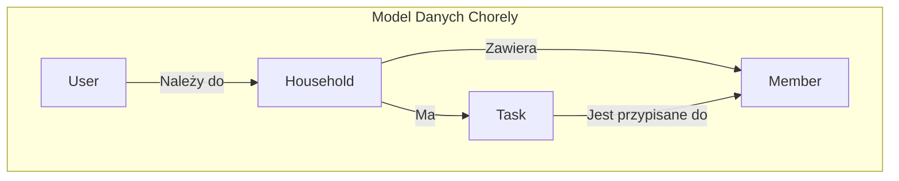

# Dokumentacja Techniczna Aplikacji Chorely

## 1. Wprowadzenie

Niniejsza dokumentacja stanowi kompleksowy przewodnik po architekturze, strukturze i wewnętrznym działaniu aplikacji Chorely. Jej celem jest dostarczenie deweloperom i osobom technicznym dogłębnego zrozumienia projektu, od ogólnej koncepcji po szczegóły implementacyjne kluczowych funkcjonalności. Dokument ten ma służyć jako centralne źródło wiedzy o projekcie, ułatwiając wdrożenie nowych członków zespołu, utrzymanie oraz dalszy rozwój aplikacji.

## 2. Filozofia i Architektura Projektu

Chorely zostało zaprojektowane z myślą o modułowości, skalowalności i łatwości utrzymania. Kluczowe decyzje architektoniczne opierają się na następujących zasadach:

*   **Architektura zorientowana na komponenty**: Interfejs użytkownika jest budowany z małych, niezależnych i reużywalnych komponentów React. Takie podejście upraszcza dewelopment, testowanie i refaktoryzację UI.
*   **Separacja warstw**: Logika aplikacji jest oddzielona od warstwy prezentacji. Strony w `src/app` pełnią rolę kontrolerów, które pobierają dane i przekazują je do "głupich" komponentów w `src/components`, które są odpowiedzialne wyłącznie za renderowanie.
*   **Centralizacja typów**: Wszystkie typy danych używane w aplikacji są zdefiniowane w jednym miejscu (`src/types`), co zapewnia spójność i bezpieczeństwo typów w całym projekcie.
*   **Utility-First CSS**: Wykorzystanie Tailwind CSS pozwala na szybkie prototypowanie i budowanie spójnych interfejsów bez opuszczania kontekstu plików TSX, co znacząco przyspiesza pracę.
*   **Renderowanie po stronie serwera (SSR) i klienta (CSR)**: Next.js daje elastyczność w wyborze strategii renderowania. Obecnie aplikacja działa głównie po stronie klienta, ale architektura jest gotowa na wykorzystanie SSR/SSG w przyszłości w celu optymalizacji wydajności.

## 3. Struktura Projektu i Szczegółowy Opis Modułów

Główny kod aplikacji znajduje się w katalogu `src/`. Poniżej przedstawiono jego strukturę wraz ze szczegółowym omówieniem przeznaczenia każdego modułu.

```
chorely/
├── .next/           # Pliki budowania Next.js
├── node_modules/    # Zależności projektu
├── public/          # Pliki statyczne (fonty, obrazki)
├── src/             # Główny kod źródłowy aplikacji
│   ├── app/         # Strony i logika aplikacji (Next.js App Router)
│   ├── components/  # Komponenty UI wielokrotnego użytku
│   ├── contexts/    # Konteksty React (globalne zarządzanie stanem)
│   ├── data/        # Domyślne/mockowe dane
│   ├── types/       # Definicje typów TypeScript
│   └── utils/       # Funkcje pomocnicze i logika biznesowa
├── .gitignore       # Pliki ignorowane przez Git
├── next.config.ts   # Konfiguracja Next.js
├── package.json     # Definicja projektu i zależności
└── tsconfig.json    # Konfiguracja TypeScript
```

### 3.1. `src/app` - Routing i Widoki

Moduł ten jest sercem aplikacji, implementując routing oparty na systemie plików Next.js (App Router). Każdy katalog w `app` odpowiada za konkretny segment URL.

*   `layout.tsx`: Główny layout aplikacji, zawierający strukturę HTML, `body` oraz opakowujący całą aplikację w `AuthProvider`.
*   `page.tsx`: Główny punkt wejścia, strona powitalna.
*   `/login`, `/register`: Strony z formularzami logowania i rejestracji.
*   `/household`: Główny panel użytkownika po zalogowaniu, wyświetlający zadania i członków gospodarstwa domowego.
*   `/profile`: Strona profilu zalogowanego użytkownika.
*   `/admin`: Panel administracyjny dla użytkowników z rolą `admin`.
*   `/member/[id]`: Dynamiczna strona profilu członka gospodarstwa domowego.
*   `/house`: Strona z unikalną funkcjonalnością wizualizacji domu 3D.

### 3.2. `src/components` - Reużywalne Klocki UI

Ten katalog zawiera zbiór komponentów React, które są "czyste" i niezależne od logiki biznesowej. Otrzymują dane i funkcje do wykonania poprzez `props`.

*   **Modale**: `TaskModal`, `MemberModal`, `HouseholdModal`, `TaskCommentsModal`, `TaskHistoryModal`, `UserManagementModal` - Służą do tworzenia, edycji i wyświetlania szczegółowych informacji w oknach modalnych, co utrzymuje czystość głównego interfejsu.
*   **Karty**: `TaskCard`, `HouseholdCard` - Komponenty do zwięzłego wyświetlania informacji o zadaniach i gospodarstwach domowych, np. w listach.
*   **Formularze**: `LoginForm`, `RegisterForm` - Dedykowane komponenty do obsługi interakcji z użytkownikiem w procesie autentykacji.

### 3.3. `src/contexts` - Globalne Zarządzanie Stanem

*   `AuthContext.tsx`: Kluczowy element zarządzania stanem sesji użytkownika. Dostarcza `user`, funkcje `login`, `register`, `logout` oraz flagę `isLoading` do wszystkich komponentów w aplikacji za pomocą hooka `useAuth`. W obecnej implementacji stan jest utrwalany w `localStorage`, symulując sesję użytkownika bez backendu.

### 3.4. `src/data` - Mockowe Źródła Danych

W tej chwili aplikacja działa w trybie "backend-less". Ten katalog zawiera dane, które symulują odpowiedzi z API.

*   `defaultUsers.ts`: Lista domyślnych użytkowników z hasłami (dla celów demonstracyjnych).
*   `defaultHouseholds.ts`: Przykładowe dane gospodarstw domowych.
*   `defaultMembers.ts`, `defaultComments.ts`, `defaultTaskHistory.ts`: Dane powiązane z gospodarstwami i zadaniami.

### 3.5. `src/types` - Kontrakty Danych

*   `index.ts`: Centralne repozytorium dla wszystkich interfejsów TypeScript. Definiuje kształt kluczowych obiektów, takich jak `User`, `Household`, `Task`, `Member`, co jest fundamentem dla bezpieczeństwa typów i IntelliSense w całym projekcie.

### 3.6. `src/utils` - Logika Biznesowa i Funkcje Pomocnicze

Moduł ten zawiera logikę, która jest reużywalna i odseparowana od warstwy UI. Każdy plik ma jasno zdefiniowaną odpowiedzialność.

*   **`validation.ts`**: Centralny punkt walidacji danych w aplikacji, zbudowany przy użyciu biblioteki Zod. Eksportuje szczegółowe schematy walidacji dla kluczowych operacji (logowanie, rejestracja) oraz modeli danych (`Household`, `Member`, `Task`). Definiuje również typy TypeScript na podstawie tych schematów (np. `TaskFormData`), co zapewnia spójność między walidacją a typowaniem. Zawiera także funkcję pomocniczą `formatZodErrors` do transformacji błędów Zod na obiekt przyjazny dla formularzy.
*   **`comments.ts`**: Zestaw funkcji CRUD (Create, Read, Update, Delete) do zarządzania komentarzami. Ponieważ aplikacja działa w trybie "backend-less", wszystkie operacje (np. `addComment`, `getCommentsForTask`, `deleteComment`) są wykonywane bezpośrednio na `localStorage`. Funkcje te hermetyzują logikę interakcji z pamięcią przeglądarki, symulując zachowanie prawdziwego API.
*   **`taskHistory.ts`**: Odpowiada za śledzenie zmian w statusie zadań. Funkcja `addTaskHistoryEntry` jest wywoływana, gdy status zadania ulega zmianie, tworząc wpis w `localStorage`. Funkcja `getTaskHistory` pozwala na pobranie historii dla konkretnego zadania lub całej historii, co jest wykorzystywane w modalu `TaskHistoryModal`.

## 4. Użyte Technologie i Biblioteki

| Technologia/Biblioteka | Wersja    | Uzasadnienie Wyboru i Sposób Użycia                                                                                                |
| ---------------------- | --------- | ------------------------------------------------------------------------------------------------------------------ |
| **Next.js**            | `15.3.2`  | Framework React zapewniający renderowanie po stronie serwera (SSR), generowanie statycznych stron (SSG) i routing oparty na plikach (App Router). Wybrany ze względu na optymalizację SEO, wydajność i doskonałe doświadczenia deweloperskie. App Router jest intensywnie wykorzystywany do strukturyzacji aplikacji. |
| **React**              | `19.0.0`  | Biblioteka do budowania interfejsów użytkownika. Model oparty na komponentach i hookach (`useState`, `useEffect`, `useContext`) stanowi podstawę całej logiki UI aplikacji.                                |
| **TypeScript**         | `5`       | Statyczne typowanie jest kluczowe dla utrzymania jakości i skalowalności kodu. Wszystkie dane, propsy i stany są ściśle otypowane, co minimalizuje błędy w czasie działania aplikacji. |
| **Tailwind CSS**       | `4`       | Framework CSS typu "utility-first", który pozwala na szybkie budowanie interfejsów bezpośrednio w kodzie JSX. Eliminuje potrzebę pisania osobnych plików CSS, co przyspiesza development.               |
| **Zod**                | `3.25.51` | Biblioteka do walidacji schematów, wykorzystywana w `src/utils/validation.ts`. Służy do walidacji danych wejściowych w formularzach, zapewniając ich zgodność z typami TypeScript przed przetworzeniem.     |
| **react-hot-toast**    | `2.5.2`   | Biblioteka do wyświetlania prostych, nieinwazyjnych powiadomień (toastów) informujących użytkownika o wynikach operacji (np. "Zalogowano pomyślnie").                               |
| **Three.js**           | `0.176.0` | Biblioteka do tworzenia grafiki 3D w WebGL. Jest fundamentem dla strony `/house`, gdzie służy do proceduralnego generowania i renderowania interaktywnego modelu 3D domu na podstawie dynamicznych właściwości. |
| **ESLint**             | `9`       | Narzędzie do statycznej analizy kodu, które dba o spójność stylu kodowania i wyłapuje potencjalne problemy na wczesnym etapie.             |

## 5. Architektura Danych i Przepływ Informacji

### 5.1. Model Danych

Podstawowe byty w systemie to `Household`, `User`, `Member` i `Task`. Relacje między nimi są następujące:
*   Jeden `User` może należeć do wielu `Household`.
*   Jeden `Household` ma wielu `Member` (mieszkańców) oraz wiele `Task` (zadań).
*   Każde `Task` jest przypisane do konkretnego `Member`.



### 5.2. Przepływ Danych (Data Flow)

Aplikacja wykorzystuje jednokierunkowy przepływ danych, typowy dla React.

1.  **Inicjalizacja**: `AuthProvider` w `layout.tsx` przy starcie aplikacji próbuje wczytać dane zalogowanego użytkownika z `localStorage`, ustawiając globalny stan `user`.
2.  **Pobieranie Danych**: Komponenty-strony (np. `household/page.tsx`) pobierają potrzebne dane. Obecnie pochodzą one z mocków w `src/data`, ale w przyszłości będą to zapytania do API.
3.  **Przekazywanie Danych (Props Drilling)**: Strony przekazują dane w dół drzewa do komponentów UI (`TaskCard`, `MemberModal`) za pomocą propsów.
4.  **Aktualizacja Stanu**:
    *   **Stan globalny**: Interakcje użytkownika (np. logowanie, wylogowanie) wywołują funkcje z `AuthContext`, które modyfikują globalny stan `user`.
    *   **Stan lokalny**: Komponenty zarządzają swoim wewnętrznym stanem (np. widoczność modala, zawartość pól formularza) za pomocą hooka `useState`.
    *   **Mutacja danych**: Gdy użytkownik wykonuje akcję (np. dodaje zadanie), komponent wywołuje funkcję (otrzymaną przez propsy), która aktualizuje stan na poziomie nadrzędnej strony. To z kolei powoduje ponowne renderowanie UI z nowymi danymi.

### 5.3. Korelacja i Kompozycja Komponentów

Architektura aplikacji silnie opiera się na kompozycji, gdzie złożone widoki są budowane z prostszych, reużywalnych "klocków". Ten wzorzec jest widoczny na wszystkich poziomach aplikacji.

*   **Strona jako Kontener**: Strony w katalogu `src/app` (np. `app/household/page.tsx`) działają jak inteligentne komponenty-kontenery. Ich głównym zadaniem jest pobranie danych (obecnie z `src/data` lub `localStorage`), zarządzanie stanem na poziomie widoku (np. który modal jest otwarty) i przekazywanie danych oraz funkcji obsługi zdarzeń do komponentów podrzędnych.
*   **Komponenty Prezentacyjne**: Komponenty w `src/components` są "głupimi" komponentami prezentacyjnymi. Nie wiedzą, skąd pochodzą dane ani co się stanie po kliknięciu przycisku.
    *   **Przykład: `TaskCard`**: Otrzymuje obiekt `Task` i wyświetla jego tytuł, priorytet itp. Otrzymuje również funkcję `onClick` od swojego rodzica (`app/household/page.tsx`). Kiedy użytkownik kliknie na kartę, `TaskCard` po prostu wywołuje tę funkcję, a strona-rodzic decyduje, co zrobić dalej (np. otworzyć `TaskModal` z danymi tego zadania).
*   **Kompozycja Modali**: Modale (np. `TaskModal`) same są złożone z mniejszych komponentów. `TaskModal` może zawierać formularz do edycji zadania, ale także przyciski do otwarcia kolejnych modali, takich jak `TaskCommentsModal` czy `TaskHistoryModal`, demonstrując zagnieżdżoną kompozycję i przepływ stanu między powiązanymi, ale oddzielnymi elementami UI.

Ten podział obowiązków sprawia, że kod jest łatwiejszy do zrozumienia, testowania i utrzymania. Komponenty UI można rozwijać i testować w izolacji (np. za pomocą Storybooka), a logika biznesowa pozostaje odseparowana na poziomie stron i funkcji pomocniczych.

## 6. Szczegółowe Omówienie Kluczowych Funkcjonalności

### 6.1. System Autentykacji (Mock)

1.  **Interfejs**: Użytkownik korzysta z komponentu `LoginForm` na stronie `/login`.
2.  **Stan Formularza**: Stan pól (email, hasło) jest zarządzany lokalnie w komponencie `LoginForm`.
3.  **Walidacja (Przyszłościowo)**: Dane będą walidowane przy użyciu schematów Zod z `src/utils/validation.ts`.
4.  **Logika Logowania**:
    *   Po submisji formularza, wywoływana jest funkcja `login` z `useAuth()`.
    *   Funkcja `login` w `AuthContext.tsx` symuluje proces autentykacji:
        a. Pobiera listę użytkowników z `localStorage`.
        b. Wyszukuje użytkownika po adresie e-mail.
        c. Haszuje podane hasło przy użyciu prostej, demonstracyjnej funkcji `simpleHash`.
        d. Porównuje hashe.
        e. W przypadku sukcesu, tworzy obiekt `AuthUser` (bez hasła) i zapisuje go w stanie kontekstu oraz w `localStorage`.
5.  **Przekierowanie**: Komponent `LoginForm` po otrzymaniu pozytywnej odpowiedzi z funkcji `login` przekierowuje użytkownika do panelu `/household`.

### 6.2. Proceduralne Generowanie Domu 3D

Strona `/house` oferuje unikalną wizualizację opartą na Three.js.

1.  **Inicjalizacja**: Komponent `HouseVisualizationPage` inicjalizuje scenę Three.js, renderer, kamerę i oświetlenie wewnątrz hooka `useEffect`. Renderer jest dołączany do elementu `div` z `mountRef`.
2.  **Definicja Właściwości**: Interfejs `HouseProperties` definiuje wszystkie parametry, które mogą opisywać dom (np. `houseWidth`, `roofType`, `hasGarage`).
3.  **Generowanie Danych**: Po wejściu na stronę, funkcja `generateRandomHouse` tworzy losowy obiekt `HouseProperties`, co zapewnia, że za każdym razem zobaczymy inny budynek.
4.  **Budowa Modelu (`buildHouse`)**: Jest to serce tej funkcjonalności. Funkcja ta, krok po kroku, tworzy obiekty `THREE.Mesh` i dodaje je do sceny:
    *   Najpierw czyści scenę z poprzedniego modelu, usuwając obiekty z flagą `userData.isHouse`.
    *   Następnie, na podstawie obiektu `HouseProperties`, tworzy geometrię (`BoxGeometry`, `ConeGeometry` itp.) i materiały dla każdej części domu: fundamentów, dachu, drzwi, okien, komina, garażu, a nawet otoczenia jak płot czy ogród z kwiatami.
    *   Każda część jest pozycjonowana relatywnie do innych, co pozwala na spójne i logiczne konstrukcje.
5.  **Interaktywność**: Użytkownik może obracać i przybliżać scenę dzięki dołączonym kontrolkom (np. `OrbitControls` z Three.js, które prawdopodobnie są zaimplementowane w dalszej części pliku).

## 7. Potencjalne Ulepszenia i Kierunki Rozwoju (Roadmap)

Aplikacja, choć funkcjonalna, ma ogromny potencjał rozwoju. Poniżej znajduje się lista możliwych przyszłych usprawnień, uszeregowana od fundamentalnych zmian po rozbudowę funkcjonalności.

*   **Pełna integracja z Backendem**:
    *   **Krok 1: API & Baza Danych**: Zastąpienie `localStorage` i mockowych danych w `src/data` oraz `src/utils` rzeczywistymi wywołaniami do API (REST lub GraphQL). Stworzenie dedykowanej bazy danych (np. PostgreSQL z Prismą jako ORM) do przechowywania danych `User`, `Household`, `Task` itp.
    *   **Krok 2: Bezpieczna Autentykacja**: Implementacja pełnoprawnej autentykacji opartej na tokenach (JWT, OAuth) po stronie backendu. Funkcje `login` i `register` w `AuthContext` powinny komunikować się z odpowiednimi endpointami API.

*   **Usprawnienia czasu rzeczywistego**:
    *   Integracja z WebSockets (np. przez Socket.io lub Ably), aby zmiany (nowe zadania, komentarze, aktualizacje statusu) były natychmiast widoczne dla wszystkich członków gospodarstwa domowego bez potrzeby odświeżania strony. To znacząco poprawi doświadczenie użytkownika.

*   **Testowanie**:
    *   **Testy jednostkowe**: Wprowadzenie testów jednostkowych dla logiki w `utils` (np. walidacja schematów Zod, logika `taskHistory`) przy użyciu bibliotek takich jak Jest/Vitest i React Testing Library.
    *   **Testy komponentów**: Testowanie komponentów UI w `src/components` w izolacji, sprawdzając ich renderowanie i interakcje.
    *   **Testy end-to-end (E2E)**: Dodanie testów E2E z użyciem Cypress lub Playwright do weryfikacji kluczowych ścieżek użytkownika (logowanie, dodawanie zadania, zmiana statusu).

*   **CI/CD (Continuous Integration/Continuous Deployment)**:
    *   Skonfigurowanie pipeline'u na platformie takiej jak GitHub Actions, który automatycznie uruchamiałby linter (`eslint`), testy i budował aplikację po każdym pushu do głównej gałęzi, zapewniając stałą jakość kodu.

*   **Zaawansowane zarządzanie stanem**:
    *   W miarę wzrostu złożoności aplikacji, `useContext` (szczególnie dla danych innych niż autentykacja) może prowadzić do niepotrzebnych re-renderów. Warto rozważyć migrację do bardziej zaawansowanych bibliotek jak Zustand lub Redux Toolkit, które oferują lepsze narzędzia do debugowania i optymalizacji wydajności.

*   **Rozbudowa funkcjonalności 3D**:
    *   **Interaktywna edycja**: Umożliwienie użytkownikom edycji właściwości domu (`HouseProperties`) w czasie rzeczywistym za pomocą formularza na stronie `/house`. Zmiana koloru czy dodanie garażu powinno natychmiastowo aktualizować model 3D.
    *   **Zapisywanie konfiguracji**: Zapisywanie konfiguracji domu w profilu `Household` lub `User` w bazie danych, aby wizualizacja była trwała.
    *   **Optymalizacja**: Wykorzystanie technik optymalizacyjnych w Three.js, takich jak `instancing` dla powtarzalnych obiektów (drzewa, płot) i zarządzanie pamięcią w celu zapewnienia płynności działania na słabszych urządzeniach.

*   **Dostępność (Accessibility - a11y)**:
    *   Przeprowadzenie audytu dostępności i zapewnienie, że aplikacja jest w pełni użyteczna dla osób z niepełnosprawnościami (zgodność z WCAG), np. poprzez poprawne użycie atrybutów ARIA, zarządzanie focusem w modalach i zapewnienie nawigacji klawiaturą.

*   **Internacjonalizacja (i18n)**:
    *   Dostosowanie aplikacji do obsługi wielu języków przy użyciu biblioteki takiej jak `next-international`, co pozwoliłoby na łatwe tłumaczenie interfejsu.

## 8. Konfiguracja i Uruchomienie

### 8.1. Wymagania

*   Node.js (wersja >= 20)
*   npm lub yarn

### 8.2. Instalacja Zależności

```bash
npm install
```

### 8.3. Uruchomienie Środowiska Deweloperskiego

```bash
npm run dev
```

Aplikacja będzie dostępna pod adresem `http://localhost:3000`. Środowisko deweloperskie oferuje Hot Module Replacement (HMR).

### 8.4. Budowanie Aplikacji Produkcyjnej

```bash
npm run build
```

Polecenie to tworzy zoptymalizowaną wersję aplikacji w katalogu `.next/`.

### 8.5. Uruchomienie Aplikacji Produkcyjnej

```bash
npm run start
```

Polecenie to uruchamia serwer produkcyjny. Aplikacja będzie dostępna pod adresem `http://localhost:3000`.